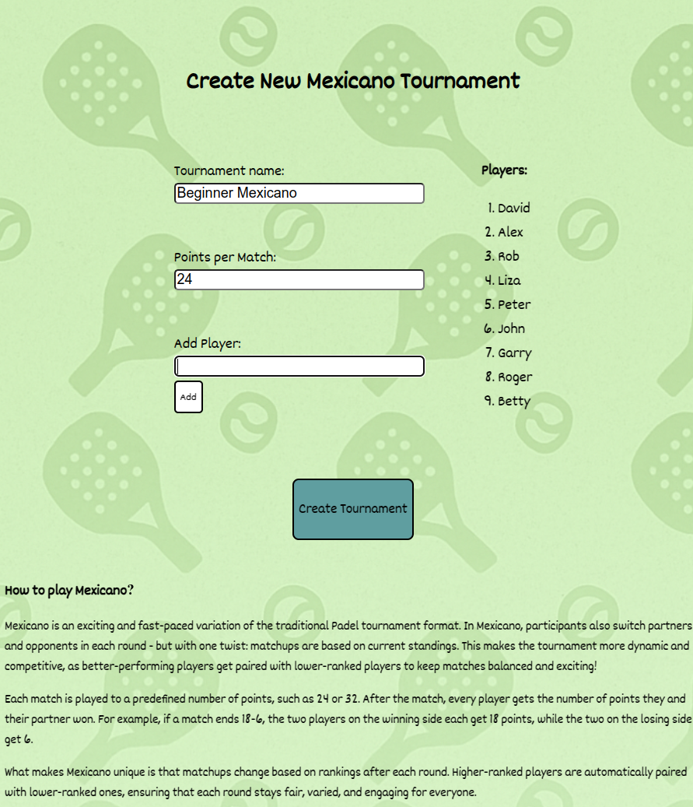

# Padel Mexicano Tournament App

[![Live on Netlify]](https://relaxed-malabi-0236c1.netlify.app/)

A fully frontend-based application to manage and simulate a Mexicano-style padel tournament. Add players, define match rules, generate smart match pairings, track scores, and view a live-updating leaderboard. All in your browser.

---

## About Mexicano Format

In Mexicano tournaments, players are paired in a way that balances team strength and fairness. Higher-ranked players are distributed across matches to ensure fun and challenging games. Players take turns sitting out, and everyone gets a fair amount of playtime. Unlike Americano, pairings are not random but follow a strategic rotation based on current standings.

---

## Screenshots

### Tournament details forms

### Standings and scores of rounds

### Leaderboard each round

### Final Standings

## Features

- Add any number of players
- Set custom number points per match
- Smart and fair team matchups based on rankings
- Automatic score calculation between teams
- Keeps track of individual player scores
- Live leaderboard after each round
- Final standings view with winner display

---

## How to Use

1. Open `index.html` in your browser
2. Fill in tournament name, points per match
3. Add players
4. Click "Create Tournament"
5. On the next page:
   - Enter match results
   - Click "Complete Round"
   - Click "New Round" to continue
6. Click "Finish Tournament" when done to see final rankings

---

## Project Structure

assets/
img/ # Background image(s)
styles/ # CSS files (one per view)
scripts/ # JS files (one per view)

index.html # Tournament setup page
play.html # Live match round view
results.html # Final leaderboard

---

## Tech Stack

- HTML5
- CSS3
- JavaScript (Vanilla)
- LocalStorage API

---

## Limitations

- No persistent backend (data stored in browser)
